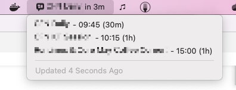

# MS Teams Meetings Launcher in SwiftBar

This plugin checks your calendar for upcoming MS Teams meetings and links them with direct links to the MS Teams desktop client. No more weird redirects through the browser, just open the meeting right away.

## Features

* Finds calendar entries for the current day that contain links to https://teams.microsoft.com and turns them to `msteams:` links that are opened by the MS Teams Desktop client right away
* Indicates an upcoming meeting 15 min before it starts with the name in the toolbar
* Shows you the name of the currently running meeting
* Warns you about a meeting that is about to start and turns the item to a direct link for this meeting
* Shows you the the warning about the next meeting, even if there is a meeting running (back to back)

## Prerequisites

1. SwiftBar 1.4.4. This will likely also work with XBar but I have not tried.
2. `icalBuddy`, can be installed via `brew install ical-buddy`.

## Troubleshooting

* issues in `icalBuddy` via Homebrew have been resolved. No known issues.
